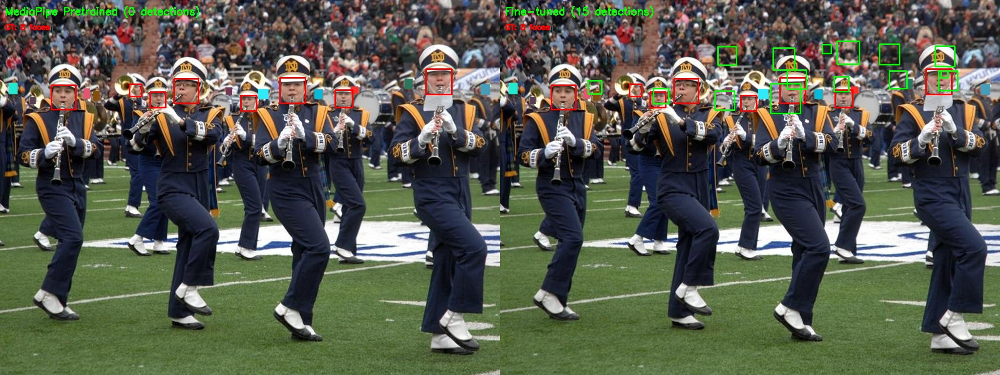
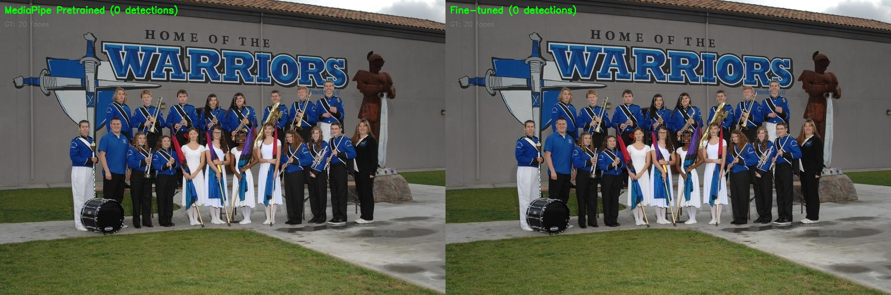
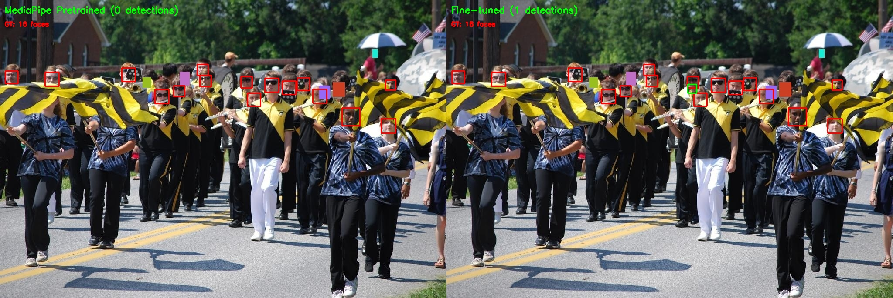

# Trainable BlazeFace

> **The first PyTorch implementation that lets you fine-tune MediaPipe's BlazeFace from pretrained weights**

[](https://www.python.org/downloads/)
[](https://pytorch.org/)
[](https://opensource.org/licenses/MIT)

---

## 🎯 The Problem

Google's [BlazeFace](https://arxiv.org/abs/1907.05047) is a remarkable piece of engineering—a face detector that runs at **200+ FPS** on mobile devices while maintaining high accuracy. MediaPipe ships pretrained weights that work brilliantly for their intended use case: detecting a single, frontal face in selfie-style images.

But what if you need to:

- Detect faces in **crowd scenes** where MediaPipe struggles?
- Adapt the detector for a **custom dataset** with different characteristics?
- Fine-tune for **domain-specific applications** (security cameras, video conferencing, etc.)?

**You're stuck.** The official MediaPipe weights are frozen artifacts. The TensorFlow Lite format is inference-only. And while several PyTorch ports exist for *running* BlazeFace, none support *training* it.

Until now.

---

## 💡 The Solution

**Trainable BlazeFace** bridges the gap between MediaPipe's frozen inference models and the flexibility of a full training pipeline. It provides:

```text
┌─────────────────────────────────────────────────────────────────────┐
│                     TRAINABLE BLAZEFACE                             │
├─────────────────────────────────────────────────────────────────────┤
│                                                                     │
│   MediaPipe Weights (.pth)                                          │
│          │                                                          │
│          ▼                                                          │
│   ┌──────────────────┐     ┌──────────────────┐                     │
│   │  Weight Unfolder │────▶│  BlazeBlock_WT   │                     │
│   │  (BatchNorm      │     │  (Trainable      │                     │
│   │   extraction)    │     │   architecture)  │                     │
│   └──────────────────┘     └────────┬─────────┘                     │
│                                     │                               │
│          ┌──────────────────────────┼──────────────────────────┐    │
│          ▼                          ▼                          ▼    │
│   ┌─────────────┐           ┌─────────────┐           ┌────────────┐│
│   │  Your Data  │           │   Anchor    │           │   Loss     ││
│   │  (CSV+Images)│           │  Encoding   │           │  Functions ││
│   └─────────────┘           └─────────────┘           └────────────┘│
│          │                          │                          │    │
│          └──────────────────────────┴──────────────────────────┘    │
│                                     │                               │
│                                     ▼                               │
│                          ┌──────────────────┐                       │
│                          │  Fine-tuned      │                       │
│                          │  BlazeFace       │                       │
│                          │  (.ckpt/.pth)    │                       │
│                          └──────────────────┘                       │
│                                                                     │
└─────────────────────────────────────────────────────────────────────┘
```

### Key Innovation: Weight Unfolding

MediaPipe's BlazeFace uses **folded BatchNorm**—the batch normalization parameters are mathematically merged into the convolution weights for inference speed. This is great for deployment but makes the model untrainable.

We reverse this process:

```python
# MediaPipe format: Conv with folded BN (inference-only)
# W_folded = W × γ / √(var + ε)
# b_folded = (b - μ) × γ / √(var + ε) + β

# Our approach: Unfold back to trainable form
def unfold_conv_bn(conv_weight, conv_bias, num_features):
    """Extract trainable conv + BatchNorm from folded weights."""
    new_conv_weight = conv_weight.clone()
    bn_weight = torch.ones(num_features)      # γ = 1
    bn_bias = conv_bias.clone()               # β absorbs original bias
    bn_running_mean = torch.zeros(num_features)  # μ = 0
    bn_running_var = torch.ones(num_features)    # σ² = 1
    return new_conv_weight, bn_weight, bn_bias, bn_running_mean, bn_running_var
```

The result? A model that produces **identical outputs** to MediaPipe at initialization, but can now be fine-tuned with gradients flowing through proper BatchNorm layers.

---

## 🏗️ Architecture

### The BlazeFace Detector

BlazeFace is an **anchor-based single-shot detector** (SSD) optimized for mobile inference. Think of it as a tiny, specialized YOLO for faces.

```text
                           INPUT IMAGE
                           128 × 128 × 3
                                │
                                ▼
                    ┌───────────────────────┐
                    │    Initial Conv       │
                    │    5×5, stride 2      │
                    │    → 24 channels      │
                    └───────────┬───────────┘
                                │
                    ╔═══════════╧═══════════╗
                    ║    BACKBONE 1         ║
                    ║    11 BlazeBlocks     ║
                    ║    24→28→32→...→88    ║
                    ╚═══════════╤═══════════╝
                                │
                    Feature Map: 16 × 16 × 88
                    ┌───────────┴───────────┐
                    │                       │
                    ▼                       ▼
          ┌─────────────────┐    ╔═══════════════════════╗
          │  Classifier 8   │    ║    BACKBONE 2         ║
          │  (2 anchors)    │    ║    5 BlazeBlocks      ║
          └────────┬────────┘    ║    88→96→96→96→96→96  ║
                   │             ╚═══════════╤═══════════╝
                   │                         │
                   │             Feature Map: 8 × 8 × 96
                   │             ┌───────────┴───────────┐
                   │             ▼                       ▼
                   │   ┌─────────────────┐    ┌─────────────────┐
                   │   │  Classifier 16  │    │  Regressor 16   │
                   │   │  (6 anchors)    │    │  (box + kpts)   │
                   │   └────────┬────────┘    └────────┬────────┘
                   │            │                      │
                   │            ▼                      ▼
          ┌────────┴────────────┴──────────────────────┴────────┐
          │                                                     │
          │              896 ANCHOR PREDICTIONS                 │
          │                                                     │
          │   ┌─────────────────────────────────────────────┐   │
          │   │  512 small anchors (16×16 grid × 2/cell)    │   │
          │   │  384 large anchors (8×8 grid × 6/cell)      │   │
          │   └─────────────────────────────────────────────┘   │
          │                                                     │
          └─────────────────────────────────────────────────────┘
```

### The BlazeBlock: Efficiency Through Simplicity

Each BlazeBlock is a **depthwise separable convolution** with a skip connection—the same building block that powers MobileNets:

```text
         Input
           │
     ┌─────┴─────┐
     │           │
     ▼           │
┌─────────┐      │
│Depthwise│      │
│ Conv 5×5│      │ (skip connection with optional
├─────────┤      │  1×1 projection if channels differ)
│BatchNorm│      │
├─────────┤      │
│  ReLU   │      │
├─────────┤      │
│Pointwise│      │
│ Conv 1×1│      │
├─────────┤      │
│BatchNorm│      │
└────┬────┘      │
     │           │
     └─────┬─────┘
           │
         (+) Add
           │
         ReLU
           │
        Output
```

**Why is this fast?** A standard 3×3 conv with C input and C output channels has `C × C × 9` parameters. Depthwise separable splits this into:

- Depthwise: `C × 9` (one filter per channel)
- Pointwise: `C × C × 1` (channel mixing only)

Total: `C × 9 + C²` vs `9 × C²` — roughly **9× fewer parameters**.

---

## 📊 The Anchor System

BlazeFace predicts face locations relative to a grid of **anchor boxes**. This is the heart of how single-shot detectors work.

### Anchor Grid Visualization

```text
                    16×16 Grid (512 anchors)                    8×8 Grid (384 anchors)
              ┌───────────────────────────────┐           ┌───────────────────────┐
              │ · · · · · · · · · · · · · · · │           │ · · · · · · · · · · ·│
              │ · · · · · · · · · · · · · · · │           │ · · · · · · · · · · ·│
              │ · · ┌─┐ · · · · · · · · · · · │           │ · · ┌───┐ · · · · · ·│
              │ · · │•│ · · · · · · · · · · · │           │ · · │ • │ · · · · · ·│
              │ · · └─┘ · · · · · · · · · · · │           │ · · └───┘ · · · · · ·│
              │ · · · · · · · · · · · · · · · │           │ · · · · · · · · · · ·│
              │ · · · · · · · · · · · · · · · │           │ · · · · · · · · · · ·│
              │ · · · · · · · · · · · · · · · │           │ · · · · · · · · · · ·│
              │ · · · · · · · · · · · · · · · │           └───────────────────────┘
              │ · · · · · · · · · · · · · · · │
              │ · · · · · · · · · · · · · · · │           Each cell: 6 anchors
              │ · · · · · · · · · · · · · · · │           (for larger faces)
              │ · · · · · · · · · · · · · · · │
              │ · · · · · · · · · · · · · · · │
              │ · · · · · · · · · · · · · · · │
              │ · · · · · · · · · · · · · · · │
              └───────────────────────────────┘

              Each cell: 2 anchors
              (for smaller faces)

                        TOTAL: 512 + 384 = 896 anchors
```

### How Anchors Work

For each anchor, the model predicts:

- **Classification score**: "Is there a face here?" (0 to 1)
- **Box regression**: Offset from anchor center to actual face location (Δy, Δx, Δh, Δw)
- **Keypoints**: 6 facial landmarks (eyes, nose, mouth, ears)

```text
Ground Truth Face              Anchor Grid                 Prediction
┌─────────────────┐    ┌─────────────────────────┐    ┌─────────────────┐
│   ┌─────────┐   │    │   ·   ·   ·   ·   ·     │    │  score = 0.95   │
│   │  😊     │   │    │   ·   ·   ·   ·   ·     │    │  Δy = +0.12     │
│   │         │   │    │   ·   ·   •───┐  ·     │    │  Δx = -0.08     │
│   └─────────┘   │────▶│   ·   ·   ·   │   ·     │────▶│  Δh = +0.31     │
│                 │    │   ·   ·   ·   │   ·     │    │  Δw = +0.25     │
│                 │    │   ·   ·   ·   ·   ·     │    │                 │
└─────────────────┘    └─────────────────────────┘    └─────────────────┘
                              ▲
                              │
                        Best matching
                        anchor (highest IoU)
```

---

## 🔬 Training Pipeline

### Data Flow

```text
┌─────────────────────────────────────────────────────────────────────────────┐
│                              TRAINING LOOP                                   │
├─────────────────────────────────────────────────────────────────────────────┤
│                                                                             │
│   CSV Data                     Image Loading                                │
│   ┌─────────┐                 ┌─────────────┐                               │
│   │image,   │                 │ Load image  │                               │
│   │x1,y1,   │───────────────▶│ Resize/pad  │                               │
│   │w,h      │                 │ to 128×128  │                               │
│   └─────────┘                 └──────┬──────┘                               │
│                                      │                                      │
│                                      ▼                                      │
│                           ┌──────────────────┐                              │
│                           │   Augmentation   │                              │
│                           │ • Flip           │                              │
│                           │ • Brightness     │                              │
│                           │ • Saturation     │                              │
│                           │ • Color jitter   │                              │
│                           │ • Scale          │                              │
│                           │ • Rotation       │                              │
│                           │ • Occlusion      │                              │
│                           │ • Cutout         │                              │
│                           └────────┬─────────┘                              │
│                                    │                                        │
│         ┌──────────────────────────┼──────────────────────────┐             │
│         ▼                          ▼                          ▼             │
│   ┌───────────┐            ┌───────────────┐          ┌────────────┐        │
│   │  Anchor   │            │    Model      │          │   Ground   │        │
│   │  Encoding │            │   Forward     │          │   Truth    │        │
│   │           │            │   Pass        │          │   Targets  │        │
│   │ Box→896   │            │               │          │            │        │
│   │ targets   │            │  BlazeFace()  │          │  cls: 0/1  │        │
│   └─────┬─────┘            └───────┬───────┘          │  box: YXYX │        │
│         │                          │                  └──────┬─────┘        │
│         │                          │                         │              │
│         ▼                          ▼                         ▼              │
│   ┌─────────────────────────────────────────────────────────────────┐       │
│   │                           LOSS FUNCTION                         │       │
│   │                                                                 │       │
│   │   L = 150 × L_box + 40 × L_bg + 80 × L_pos                      │       │
│   │                                                                 │       │
│   │   L_box: Huber loss on positive anchor box predictions          │       │
│   │   L_bg:  Focal loss on hard negative backgrounds                │       │
│   │   L_pos: Focal loss on positive anchors (faces)                 │       │
│   │                                                                 │       │
│   │   Hard Negative Mining: Select 1.5× negatives per positive      │       │
│   │   (highest scoring false positives are most informative)        │       │
│   │                                                                 │       │
│   └───────────────────────────────────┬─────────────────────────────┘       │
│                                       │                                     │
│                                       ▼                                     │
│                              ┌─────────────────┐                            │
│                              │   Backprop +    │                            │
│                              │   AdamW Update  │                            │
│                              └─────────────────┘                            │
│                                                                             │
└─────────────────────────────────────────────────────────────────────────────┘
```

### Loss Functions: The Recipe for Learning

Training an object detector is tricky because of **class imbalance**: for every anchor that matches a face, there are dozens that match background. We handle this with:

#### 1. **Focal Loss** (Classification)

Standard cross-entropy treats all examples equally. Focal loss down-weights easy examples (obvious backgrounds) and focuses on hard cases:

```text
                Standard BCE                    Focal Loss (γ=2)
        │                                │
   Loss │\                               │\
        │ \                              │ \
        │  \                             │  \__________
        │   \                            │
        │    \_____                      │
        │                                │
        └────────────▶                   └────────────▶
           Confidence                       Confidence

"Easy examples dominate             "Hard examples dominate
 gradient updates"                   gradient updates"
```

#### 2. **Hard Negative Mining**

Instead of using all 800+ background anchors, we select only the **most confident false positives**—the backgrounds the model mistakenly thinks are faces. These are the most informative examples for learning.

#### 3. **Huber Loss** (Box Regression)

Smoother than L1, more robust to outliers than L2:

```text
            L2 Loss                         Huber Loss
        │      /                        │
   Loss │     /                         │     /
        │    /                          │    /
        │   /                           │   ╱ (linear for large errors)
        │  /                            │  ╱
        │ /                             │ ╱_____ (quadratic for small errors)
        └────────────▶                  └────────────▶
           Error                           Error
```

---

## 🔄 Data Augmentation

The training pipeline uses a comprehensive set of augmentations to improve model robustness and generalization. Each augmentation is applied with a probability (50% for common, 30% for occlusion-based).

### Color Augmentations

| Augmentation | Probability | Description |
|--------------|-------------|-------------|
| **Saturation** | 50% | Random saturation shift in HSV space (0.75–1.25×) |
| **Brightness** | 50% | Random value shift in HSV space (0.75–1.25×) |
| **Color Jitter** | 50% | Combined H/S/V perturbation: hue ±10°, sat 0.8–1.2×, val 0.8–1.2× |

### Geometric Augmentations

| Augmentation | Probability | Description |
|--------------|-------------|-------------|
| **Horizontal Flip** | 50% | Mirror image with bbox coordinate adjustment |
| **Random Scale** | 50% | Scale 0.85–1.15× with center crop/pad, bbox rescaling |
| **Random Rotation** | 50% | Rotate ±10° with bounding box recalculation |

### Occlusion Augmentations

| Augmentation | Probability | Description |
|--------------|-------------|-------------|
| **Synthetic Occlusion** | 30% | Gray rectangles over 30–60% of random face bboxes |
| **Cutout** | 30% | Random 10–25px rectangular patches filled with mean color |

### Augmentation Pipeline

```text
┌─────────────────────────────────────────────────────────────────┐
│                    INPUT IMAGE + BBOXES                         │
└─────────────────────────────────────────────────────────────────┘
                              │
                              ▼
┌─────────────────────────────────────────────────────────────────┐
│                     COLOR AUGMENTATIONS                         │
│  ┌──────────────┐  ┌──────────────┐  ┌──────────────┐           │
│  │  Saturation  │  │  Brightness  │  │ Color Jitter │           │
│  │   (50%)      │  │   (50%)      │  │   (50%)      │           │
│  └──────────────┘  └──────────────┘  └──────────────┘           │
└─────────────────────────────────────────────────────────────────┘
                              │
                              ▼
┌─────────────────────────────────────────────────────────────────┐
│                   GEOMETRIC AUGMENTATIONS                       │
│  ┌──────────────┐  ┌──────────────┐  ┌──────────────┐           │
│  │   H-Flip     │  │ Random Scale │  │  Rotation    │           │
│  │   (50%)      │  │   (50%)      │  │   (50%)      │           │
│  │              │  │ 0.85–1.15×   │  │  ±10°        │           │
│  └──────────────┘  └──────────────┘  └──────────────┘           │
└─────────────────────────────────────────────────────────────────┘
                              │
                              ▼
┌─────────────────────────────────────────────────────────────────┐
│                   OCCLUSION AUGMENTATIONS                       │
│  ┌──────────────────────┐  ┌───────────────────────┐            │
│  │ Synthetic Occlusion  │  │       Cutout          │            │
│  │      (30%)           │  │       (30%)           │            │
│  │ Gray boxes on faces  │  │ Random patch removal  │            │
│  └──────────────────────┘  └───────────────────────┘            │
└─────────────────────────────────────────────────────────────────┘
                              │
                              ▼
┌─────────────────────────────────────────────────────────────────┐
│                    AUGMENTED OUTPUT                             │
└─────────────────────────────────────────────────────────────────┘
```

### Why These Augmentations?

| Augmentation Type | Addresses |
|-------------------|-----------|
| Color variations | Different lighting, cameras, skin tones |
| Geometric | Different face orientations, camera distances |
| Occlusion | Partial face visibility, overlapping objects |

---

## 📈 Experimental Results

### Visual Comparison: Before vs After Training

| MediaPipe Pretrained (left) vs Fine-tuned (right) |
|:--:|
|  |
|  |
|  |

*Green boxes = model detections, Gray boxes = ground truth. Notice how fine-tuning dramatically improves detection of multiple faces.*

### Before Training: MediaPipe Pretrained Weights

We evaluated the stock MediaPipe weights on the [WIDER FACE](http://shuoyang1213.me/WIDERFACE/) validation set—a challenging benchmark with faces at all scales, poses, and occlusion levels.

| Metric | Value |
|--------|-------|
| Images Evaluated | 500 |
| Ground Truth Faces | 3,024 |
| Detections | 192 |
| **Precision** | **97.9%** |
| **Recall** | **6.2%** |
| **F1 Score** | **11.7%** |

**The Story**: MediaPipe's weights are *precise but conservative*. When they detect a face, they're almost always right (97.9% precision). But they miss most faces in crowd scenes (6.2% recall). This makes sense—MediaPipe was designed for **single frontal selfie faces**, not crowded images with small, occluded, or profile faces.

### Training Progress: Learning to See More Faces

We fine-tuned the MediaPipe weights on WIDER FACE training set (32,325 images, 87,301 face annotations):

```text
Training Configuration:
├── Epochs: 12 (resumed from checkpoint)
├── Batch Size: 32
├── Learning Rate: 0.0005 (AdamW)
├── Loss: Focal (classification) + Huber (regression)
└── Device: NVIDIA CUDA GPU
```

#### Training Metrics Over Time

| Epoch | Train Loss | Val Loss | Pos Accuracy | Bg Accuracy | **Val IoU** |
|-------|------------|----------|--------------|-------------|-------------|
| 1     | 7.54       | 6.68     | 74.7%        | 93.1%       | 0.499       |
| 2     | 6.20       | 6.30     | 74.6%        | 94.4%       | 0.521       |
| 3     | 5.64       | 5.97     | 76.1%        | 94.3%       | 0.548       |
| 4     | 5.67       | 6.02     | 74.7%        | 95.0%       | 0.553       |
| 5     | 5.80       | 6.23     | 78.9%        | 92.6%       | 0.543       |
| 6     | 5.83       | 5.98     | 75.3%        | 94.5%       | 0.534       |
| 7     | 5.65       | 5.87     | 78.4%        | 95.0%       | 0.558       |
| 8     | 5.37       | 5.69     | 76.3%        | 95.4%       | 0.571       |
| 9     | 5.27       | 5.68     | 77.6%        | 94.7%       | **0.571**   |
| 10    | 5.31       | 5.65     | 77.6%        | 95.2%       | 0.570       |
| 11    | 5.49       | 5.86     | 76.0%        | 94.6%       | 0.560       |
| 12    | 5.53       | 6.06     | 79.7%        | 92.5%       | 0.544       |

**Final Results**:

- **Best Val IoU: 0.571** (epoch 9) — **14.5% improvement** from 0.499
- **Final mAP@0.5: 68.0%** (computed on full validation set)
- **Val Loss: 5.65** (best) — **15.4% reduction** from 6.68

**Key Observations**:

- **Val IoU improved 14.5%** (0.499 → 0.571) over 12 epochs
- **Loss dropped 15%** on validation set
- **Background accuracy** peaked at 95.4% (better at rejecting false positives)
- **Model learns quickly** from the MediaPipe initialization (transfer learning advantage)
- **Best model at epoch 9-10** — slight overfitting after that

### The Takeaway

The stock MediaPipe weights are like a specialist—brilliant at their narrow task (single frontal faces), but limited. After fine-tuning on WIDER FACE:

```text
              BEFORE                              AFTER 12 EPOCHS
     ┌─────────────────────────┐         ┌─────────────────────────┐
     │ MediaPipe Pretrained    │         │ Fine-tuned on WIDER     │
     ├─────────────────────────┤         ├─────────────────────────┤
     │                         │         │                         │
     │  😊 → ✓                 │         │  😊😊😊 → ✓✓✓           │
     │                         │         │                         │
     │  Single frontal face    │         │  Multiple faces         │
     │  High confidence only   │    ──▶  │  Varied scales          │
     │  Limited scale range    │         │  Profiles & occlusion   │
     │                         │         │                         │
     │  Precision: 97.9%       │         │  Val IoU: 0.571         │
     │  Recall:    6.2%        │         │  mAP@0.5: 68.0%         │
     │  Val IoU:   0.499       │         │  +14.5% improvement     │
     │                         │         │                         │
     └─────────────────────────┘         └─────────────────────────┘
```

*For production use, we recommend training for 20-50 epochs with learning rate scheduling and early stopping.*

---

## 🚀 Quick Start

### Installation

```bash
git clone https://github.com/shameem4/trainable_blazeface.git
cd trainable_blazeface
pip install -r requirements.txt
```

### Training from MediaPipe Weights

```bash
# Fine-tune on your data starting from MediaPipe weights
python train_blazeface.py \
    --train-data data/splits/train.csv \
    --val-data data/splits/val.csv \
    --data-root data/raw/blazeface \
    --epochs 50 \
    --batch-size 32 \
    --lr 0.0005

# Or train from scratch (random initialization)
python train_blazeface.py \
    --init-weights scratch \
    --train-data data/splits/train.csv \
    ...
```

### Data Format

Prepare a CSV with columns:

```csv
image_path,x1,y1,w,h
path/to/image1.jpg,100,150,50,60
path/to/image1.jpg,200,100,45,55
path/to/image2.jpg,50,80,70,80
```

Where `x1, y1` is the top-left corner and `w, h` are width/height in **pixels**.

### Running Demos

```bash
# Webcam demo
python utils/webcam_demo.py --weights runs/checkpoints/BlazeFace_best.pth

# Image demo with ground truth comparison
python utils/image_demo.py --weights runs/checkpoints/BlazeFace_best.pth --csv data/splits/val.csv
```

---

## 📁 Project Structure

```text
trainable_blazeface/
├── blazebase.py          # Base classes, weight conversion, anchor generation
├── blazeface.py          # BlazeFace model (BlazeBlock_WT architecture)
├── blazedetector.py      # Inference utilities (NMS, box decoding)
├── dataloader.py         # CSV dataset, anchor encoding, augmentation
├── loss_functions.py     # Focal loss, Huber loss, hard negative mining
├── train_blazeface.py    # Training script with full pipeline
│
├── model_weights/
│   ├── blazeface.pth     # MediaPipe pretrained weights
│   └── anchors.npy       # Precomputed anchor coordinates
│
├── data/
│   ├── splits/           # Train/val CSV splits
│   └── raw/blazeface/    # Images organized by category
│
├── runs/
│   ├── checkpoints/      # Saved model weights
│   └── logs/             # TensorBoard logs
│
└── utils/
    ├── anchor_utils.py   # Vectorized anchor operations
    ├── augmentation.py   # Data augmentation functions
    ├── box_utils.py      # Box format conversions
    ├── config.py         # Default paths and settings
    ├── drawing.py        # Visualization utilities
    ├── iou.py            # IoU computation (batch/single)
    ├── metrics.py        # Precision, recall, mAP
    ├── model_utils.py    # Model loading helpers
    ├── webcam_demo.py    # Real-time webcam detection
    ├── image_demo.py     # Image detection with GT comparison
    └── debug_training.py # Training visualization tools
```

---

## 🔧 Design Decisions & Trade-offs

### Why Keep Keypoint Heads?

MediaPipe's BlazeFace outputs both **bounding boxes** and **6 facial keypoints**. We keep the keypoint heads in the architecture (frozen during training) because:

1. **Weight compatibility**: Dropping layers would break MediaPipe weight loading
2. **Future flexibility**: Keypoints can be trained later with appropriate data
3. **Minimal overhead**: Frozen heads add negligible computation

### Why Not Use the Paper's Architecture?

The original BlazeFace paper describes "double" BlazeBlocks for the back-facing model. MediaPipe's actual implementation is simpler:

- **Single BlazeBlocks** throughout
- **Two feature pyramid levels** (16×16 and 8×8)
- **Fixed anchor sizes** (predictions scaled by input size only)

We match MediaPipe's implementation exactly to ensure weight compatibility.

### Box Format: MediaPipe Convention

We use `[ymin, xmin, ymax, xmax]` (normalized 0-1) throughout, matching MediaPipe's internal format. This avoids conversion errors and makes debugging easier.

---

## 📚 References & Acknowledgments

### Papers

1. **BlazeFace**: Bazarevsky, V., et al. "BlazeFace: Sub-millisecond Neural Face Detection on Mobile GPUs." *CVPR Workshop on Computer Vision for AR/VR*, 2019. [[arXiv]](https://arxiv.org/abs/1907.05047)

2. **Focal Loss**: Lin, T., et al. "Focal Loss for Dense Object Detection." *ICCV*, 2017. [[arXiv]](https://arxiv.org/abs/1708.02002)

3. **MobileNets**: Howard, A., et al. "MobileNets: Efficient Convolutional Neural Networks for Mobile Vision Applications." 2017. [[arXiv]](https://arxiv.org/abs/1704.04861)

### Code

This project builds upon the excellent work of:

- **[hollance/BlazeFace-PyTorch](https://github.com/hollance/BlazeFace-PyTorch)**: PyTorch port of BlazeFace inference
- **[vincent1bt/blazeface-tensorflow](https://github.com/vincent1bt/blazeface-tensorflow)**: Training methodology and loss functions
- **[zmurez/MediaPipePyTorch](https://github.com/zmurez/MediaPipePyTorch/)**: Additional MediaPipe model conversions
- **[google/mediapipe](https://github.com/google/mediapipe)**: Original BlazeFace implementation

### Dataset

- **[WIDER FACE](http://shuoyang1213.me/WIDERFACE/)**: Yang, S., et al. "WIDER FACE: A Face Detection Benchmark." *CVPR*, 2016.
- **[Kaggle Face Detection Dataset](https://www.kaggle.com/datasets/ngoduy/dataset-for-face-detection)**: Additional face detection dataset with diverse annotations.
- **[LFPW Dataset](https://www.kaggle.com/datasets/amitmondal98/lfpw-labelled-face-parts-in-the-wild/data)**: Labeled Face Parts in the Wild dataset for facial landmark detection.

### Annotation Generation with RetinaFace

We use **[serengil/retinaface](https://github.com/serengil/retinaface)** to automatically generate face detection annotations for custom datasets. This allows you to create training data from any image collection without manual labeling.

The `image_prep.py` script scans an image directory, runs RetinaFace detection, and outputs CSV annotations compatible with our training pipeline:

```bash
# Generate annotations for all images in a directory
python image_prep.py --image-dir data/raw/blazeface/ --threshold 0.9

# This creates:
#   data/splits/retinaface_master.csv  (all detections)
#   data/splits/train.csv              (80% training split)
#   data/splits/val.csv                (20% validation split)
```

**Key options:**

| Flag | Description | Default |
|------|-------------|---------|
| `--image-dir` | Directory containing images to scan | `data/raw/blazeface/` |
| `--threshold` | Detection confidence threshold | `0.9` |
| `--val-fraction` | Fraction of images for validation | `0.2` |
| `--allow-upscaling` | Allow RetinaFace to upscale small images | `False` |

**Output CSV format:**

```csv
image_path,x1,y1,width,height,score
0--Parade/image.jpg,120,45,80,95,0.998
```

This workflow enables knowledge distillation—training the lightweight BlazeFace using pseudo-labels from the more accurate (but slower) RetinaFace detector.

---

## ⚠️ Known Limitations

### Train/Val Split

The current train/validation split is not optimal and may contain duplicate or near-duplicate images across splits. This can lead to:

- Overly optimistic validation metrics
- Potential data leakage between train and val sets

For production use, consider:

- Using the official WIDER FACE train/val splits
- Implementing proper deduplication (e.g., perceptual hashing)
- Ensuring no image appears in both sets

---

## 📄 License

MIT License. See [LICENSE](LICENSE) for details.

---
